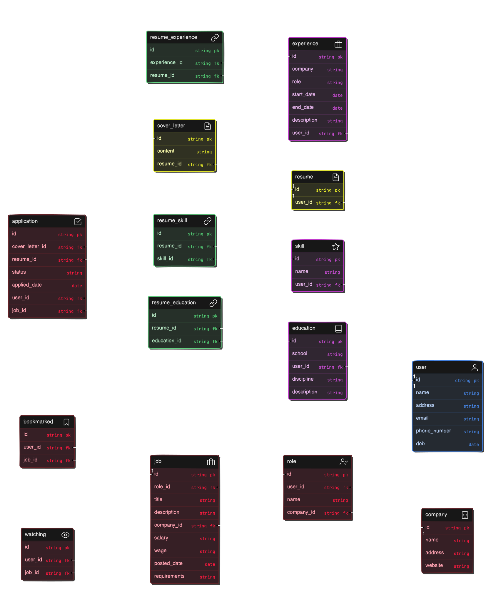

# Apply AI

**Apply AI** is a platform that revolutionizes job applications. Our advanced AI technology creates tailored resumes and cover letters for you, maximizing your chances of success. Stay informed with personalized notifications for your dream companies.

## Table of Contents
- [Installation](#installation)
- [Configuration](#configuration)
- [Usage](#usage)
- [Contributing](#contributing)
- [ERD](#ERD)

## Installation

To install **Apply AI**, follow these steps:

1. Clone the repository:
`git clone https://github.com/aldoportillo/apply-ai.git`

2. Navigate to the project directory:
`cd apply-ai`

3. Install the required gems:
`bundle install`

4. Set up the database:
`rails db:setup`

5. Start the Rails server:
`rails server`

## Configuration

**TODO:** Add instructions for configuring the application

## Usage

1. Start the Rails server:
`rails server`

2. Open your browser and navigate to http://localhost:3000
Follow the on-screen instructions to use the application

## Contributing

Contributions are welcome! Please follow these guidelines:

1. Fork the repository
2. Create a new branch (`git checkout -b issue#-initials-feature-branch` ie. 1-ap-initial-commit)
3. Commit your changes (`git commit -m 'Add some feature'`)
4. Push to the branch (`git push origin issue#-initials-feature-branch` ie. 1-ap-initial-commit)
5. Open a pull request

## ERD

## Visuals

## API Reference
